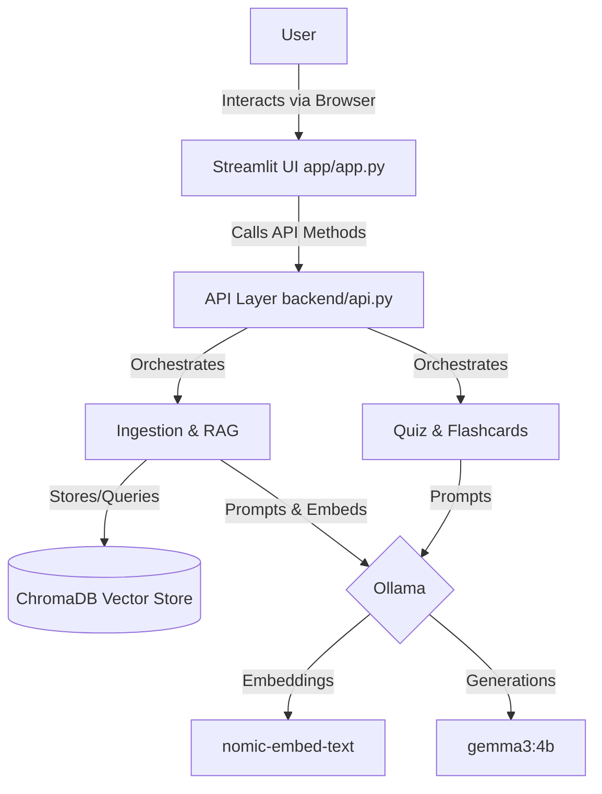

# StudyBuddy Architecture

StudyBuddy follows a strictly modular architecture, separating the local inference logic (via Ollama) from the business API (Python/RAG) and the presentation layer (Streamlit).

## System Flow

## Component Breakdown

1. **Streamlit UI (`app/`)**: Handles rendering of components, chat interface, and document upload forms. Managed entirely by P2.
2. **API Layer (`backend/api.py`)**: A set of strict Python functions that acts as the contract between the UI and the underlying RAG system.
3. **Ingestion & Retrieval (`backend/ingest.py`, `backend/rag.py`)**: Responsible for parsing PDFs and TXT files, chunking them, storing vector embeddings in ChromaDB, and retrieving the top-K relevant chunks for a user query.
4. **LLM Engine (`backend/llm.py`)**: Acts as a client for Ollama, managing model interactions, prompt construction, and error handling (e.g. `OllamaNotRunning`).
5. **Generation (`backend/quiz.py`)**: Contains specialized prompts and JSON parsing logic for generating strictly formatted multiple-choice quizzes and flashcards.
